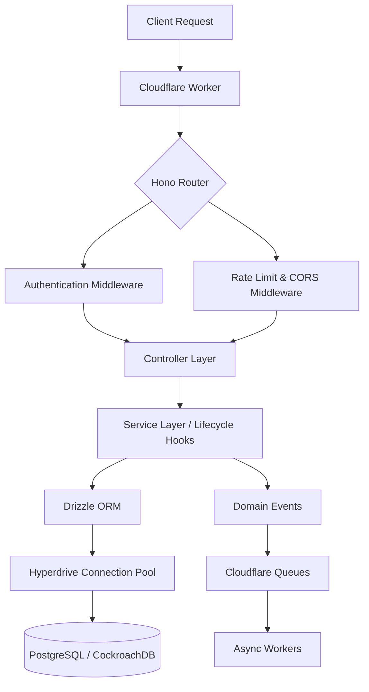
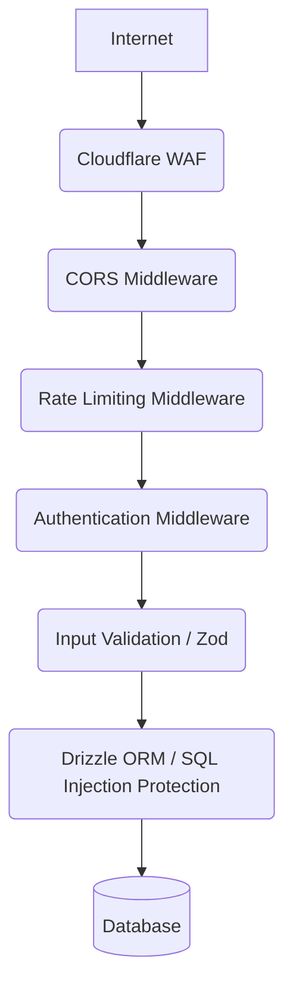

# EdgeAPI Generator — সম্পূর্ণ প্রযুক্তিগত ডকুমেন্টেশন

> একটি declarative specification থেকে Cloudflare Workers-এ production-ready API তৈরির সম্পূর্ণ গাইড।

## ১. প্রকল্পের পরিচিতি

### কী এবং কেন
EdgeAPI Generator হলো একটি অত্যাধুনিক, ইভেন্ট-চালিত (event-driven) CRUD API জেনারেটর, যা বিশেষভাবে Cloudflare Workers-এর জন্য তৈরি করা হয়েছে। আধুনিক সার্ভারলেস (serverless) আর্কিটেকচারে একটি শক্তিশালী এবং স্কেলেবল ব্যাকএন্ড তৈরি করা প্রায়শই সময়সাপেক্ষ এবং জটিল। এই টুলটি ডেভেলপারদের একটি মাত্র JSON ফাইলের মাধ্যমে পুরো API-এর আর্কিটেকচার বর্ণনা করার সুযোগ দেয়। এরপর এটি স্বয়ংক্রিয়ভাবে প্রোডাকশনের জন্য উপযুক্ত, টাইপ-সেইফ (type-safe) এবং অপটিমাইজড কোড তৈরি করে। 

### টেক স্ট্যাক (Tech Stack)
এই প্রকল্পটিতে বেশ কয়েকটি আধুনিক প্রযুক্তির সমন্বয় ঘটানো হয়েছে:
* **Cloudflare Workers:** গ্লোবাল ডিস্ট্রিবিউটেড সার্ভারলেস কম্পিউটিং প্ল্যাটফর্ম, যা লেটেন্সি কমায়।
* **Hono:** একটি অত্যন্ত দ্রুতগামী, লাইটওয়েট ওয়েব ফ্রেমওয়ার্ক যা Cloudflare Workers-এর সাথে চমৎকারভাবে কাজ করে।
* **Drizzle ORM:** একটি টাইপ-সেইফ ORM (Object-Relational Mapper) যা SQL ডেটাবেস (যেমন PostgreSQL বা CockroachDB) এর সাথে যোগাযোগ সহজ করে।
* **Hyperdrive:** Cloudflare-এর ডেটাবেস কানেকশন পুলিং সার্ভিস যা গ্লোবাল কানেকশন স্পিড বৃদ্ধি করে।
* **Better-Auth:** প্রমাণীকরণ (Authentication) এবং সেশন পরিচালনার জন্য ব্যবহৃত একটি শক্তিশালী লাইব্রেরি।
* **Zod:** রানটাইমে ডেটা ভ্যালিডেশনের জন্য একটি স্কিমা ডিক্লারেশন লাইব্রেরি।
* **TypeScript:** জাভাস্ক্রিপ্টের সুপারসেট যা টাইপ সেফটি নিশ্চিত করে এবং ডেভেলপমেন্টের সময় ভুল কমায়।

### মূল দর্শন: "এক ফাইলে লিখুন, সম্পূর্ণ API পান"
এই জেনারেটরের মূল দর্শন হলো "Infrastructure as Code" এবং "API as Data"। ডেভেলপারকে কেবল `application.json` ফাইলে সত্তা (Entities), ফিল্ড (Fields), ডেটাবেস কনফিগারেশন এবং সিকিউরিটি পলিসি সংজ্ঞায়িত করতে হয়। বাকি সমস্ত কাজ (যেমন রাউটিং, কন্ট্রোলার, সার্ভিস লেয়ার, ডেটাবেস মাইগ্রেশন, ইভেন্ট হ্যান্ডলার) টুলটি নিজে থেকে করে দেয়।

### Architecture Flow Diagram



## ২. দ্রুত শুরু করুন

### প্রয়োজনীয়তা
এই টুলটি ব্যবহার করার আগে আপনার সিস্টেমে নিম্নলিখিত জিনিসগুলো থাকতে হবে:
১. **Node.js:** সংস্করণ ১৮ বা তার উপরের যেকোনো সংস্করণ।
২. **npm, pnpm বা yarn:** প্যাকেজ ম্যানেজার।
৩. **Cloudflare Account:** Cloudflare-এ একটি সক্রিয় অ্যাকাউন্ট এবং Wrangler CLI ইনস্টল করা।
৪. **PostgreSQL ডেটাবেস:** লোকাল বা ক্লাউড ভিত্তিক (যেমন Supabase বা Neon)।

### পদক্ষেপগুলো
১. প্রথমে একটি নতুন ফোল্ডার তৈরি করুন এবং সেখানে প্রবেশ করুন।
২. জেনারেটর টুলটি ইনিশিয়ালাইজ করুন।
৩. আপনার `application.json` ফাইলে প্রয়োজনীয় কনফিগারেশন লিখুন।
৪. কোড জেনারেট করুন।
৫. ডেভেলপমেন্ট সার্ভার চালু করুন।

### CLI Commands

```bash
# নতুন প্রজেক্ট ডিরেক্টরি তৈরি করুন
mkdir my-edge-api
cd my-edge-api

# জেনারেটর ইনিশিয়ালাইজ করুন
npx edge-api-generator init

# স্পেসিফিকেশন অনুযায়ী কোড জেনারেট করুন
npx edge-api-generator generate

# Cloudflare Workers এ লোকালি রান করুন
npm run dev
```

### প্রথম API Request Example

> [!NOTE]
> সার্ভার চালু হওয়ার পর ডিফল্ট পোর্ট সাধারণত `8787` হয়।

```bash
# একটি নতুন প্রোডাক্ট তৈরি করা
curl -X POST http://localhost:8787/api/v1/products \
  -H "Content-Type: application/json" \
  -d '{"name": "Awesome Widget", "price": 99.99, "status": "active"}'
```

## ৩. Application Specification বিস্তারিত

আপনার API-এর মূল ভিত্তি হলো `application.json` ফাইল। নিচে এই ফাইলের প্রতিটি অংশের বিস্তারিত বর্ণনা দেওয়া হলো।

### ৩.১ application — অ্যাপ্লিকেশনের মূল তথ্য

এখানে আপনার API-এর সাধারণ তথ্য যেমন নাম, ডোমেইন, ফ্রেমওয়ার্ক ইত্যাদি থাকে।

| সম্পত্তি / Property | ধরন / Type | বর্ণনা |
|-------------------|------------|--------|
| `name` | string | API-এর সুন্দর একটি নাম (যেমন: TaskMaster API)। |
| `domain` | string | ডোমেইন বা প্রজেক্টের সংক্ষিপ্ত নাম, যা ইভেন্ট নেমিং এ ব্যবহৃত হয়। |
| `apiPrefix` | string | API রাউটের প্রিফিক্স (যেমন: `/api/v1`)। |
| `runtime` | string | রানটাইম পরিবেশ (সর্বদা `cloudflare-workers`)। |
| `framework` | string | ওয়েব ফ্রেমওয়ার্ক (সর্বদা `hono`)। |
| `language` | string | প্রোগ্রামিং ভাষা (সর্বদা `typescript`)। |

**উদাহরণ:**
```json
"application": {
  "name": "E-Commerce API",
  "domain": "ecommerce-core",
  "apiPrefix": "/api/v1",
  "runtime": "cloudflare-workers",
  "framework": "hono",
  "language": "typescript"
}
```

### ৩.২ database — ডেটাবেস কনফিগারেশন

এই অংশে ডেটাবেস সম্পর্কিত তথ্য সংজ্ঞায়িত করা হয়। 

**Hyperdrive কী এবং কেন?**
Cloudflare Workers হলো সার্ভারলেস ফাংশন, যার অর্থ হলো এটি প্রতিবার নতুন করে শুরু হতে পারে। প্রথাগত রিলেশনাল ডেটাবেসে (যেমন PostgreSQL) বারবার নতুন কানেকশন তৈরি করা সময়সাপেক্ষ এবং ডেটাবেসের উপর প্রচুর চাপ ফেলে। Cloudflare Hyperdrive এই সমস্যার সমাধান করে। এটি একটি কানেকশন পুলার হিসেবে কাজ করে, যা Cloudflare-এর গ্লোবাল নেটওয়ার্ক থেকে ডেটাবেস কানেকশনগুলো ম্যানেজ করে, ফলে রেসপন্স টাইম অনেক কমে যায়।

**Drizzle ORM**
Drizzle হলো একটি অত্যন্ত লাইটওয়েট এবং টাইপ-সেইফ ORM। এটি সরাসরি SQL লেখার অনুভূতি দেয় কিন্তু টাইপস্ক্রিপ্টের সমস্ত সুবিধা প্রদান করে।

```json
"database": {
  "provider": "postgresql",
  "connection": "hyperdrive",
  "binding": "HYPERDRIVE",
  "orm": "drizzle"
}
```

### ৩.৩ authentication — প্রমাণীকরণ

EdgeAPI Generator প্রমাণীকরণের জন্য Better-Auth ব্যবহার করে, যা অত্যন্ত সুরক্ষিত এবং সহজে ব্যবহারযোগ্য।

**Session Flow (সেশন প্রবাহ):**
১. ব্যবহারকারী লগইন করলে একটি সেশন টোকেন তৈরি হয়।
২. API রিকোয়েস্টের সময় এই টোকেনটি `Bearer token` হিসেবে পাঠানো হয়।
৩. Cloudflare Worker প্রথমে টোকেনটি **KV cache (Workers KV)**-এ খোঁজে। এটি অত্যন্ত দ্রুত এবং ডেটাবেস হিট বাঁচায়।
৪. যদি KV cache-এ টোকেনটি না পাওয়া যায়, তবে সিস্টেমটি মূল ডেটাবেসে (DB fallback) টোকেন যাচাই করে এবং পুনরায় KV-তে ক্যাশ করে রাখে।

```json
"authentication": {
  "provider": "better-auth",
  "session": {
    "cache": "workers-kv",
    "kvBinding": "AUTH_SESSION_KV"
  }
}
```

### ৩.৪ security — নিরাপত্তা 

নিরাপত্তা একটি অত্যন্ত গুরুত্বপূর্ণ অংশ। এই অংশে আপনি আপনার API-এর গ্লোবাল নিরাপত্তা নীতি নির্ধারণ করতে পারেন।

* **defaultAuth:** এটি `true` হলে, API-এর সমস্ত রাউটে বাই-ডিফল্ট প্রমাণীকরণ (Authentication) প্রয়োজন হবে। যদি কোনো রাউটকে পাবলিক করতে চান, তবে কোডে `@Public()` ডেকোরেটর ব্যবহার করে তা বাদ দেওয়া যাবে।
* **CORS কনফিগারেশন:** Cross-Origin Resource Sharing (CORS) নির্ধারণ করে কোন কোন ডোমেইন থেকে আপনার API অ্যাক্সেস করা যাবে। `origins` অ্যারেতে অনুমোদিত ডোমেইনগুলো উল্লেখ করতে হয়।
* **Rate Limiting:** এটি API-কে ব্রুট-ফোর্স বা ডিনায়েল-অফ-সার্ভিস (DoS) আক্রমণ থেকে রক্ষা করে। এটি sliding window algorithm ব্যবহার করে এবং রেট লিমিট ডেটা Workers KV-তে সেভ করে। লিমিট অতিক্রম করলে `429 Too Many Requests` রেসপন্স দেওয়া হয়।

**উদাহরণ JSON:**
```json
"security": {
  "defaultAuth": true,
  "cors": { 
    "origins": ["https://myapp.com"], 
    "credentials": true 
  },
  "rateLimit": { 
    "enabled": true, 
    "windowMs": 60000, 
    "maxRequests": 100, 
    "store": "kv" 
  }
}
```

### ৩.৫ entities — সত্তা সংজ্ঞা 

এটি স্পেসিফিকেশনের সবচেয়ে গুরুত্বপূর্ণ অংশ। এখানে আপনি আপনার ডেটা মডেলগুলো (Entities) সংজ্ঞায়িত করবেন।

**Field Types এবং Drizzle Column Output:**
* `uuid`: UUID স্ট্রিং (Drizzle এ `uuid()` হিসেবে ম্যাপ হয়)।
* `string`: সাধারণ টেক্সট (Drizzle এ `varchar()` হিসেবে ম্যাপ হয়)।
* `integer`: পূর্ণসংখ্যা (Drizzle এ `integer()` হিসেবে ম্যাপ হয়)।
* `boolean`: সত্য/মিথ্যা (Drizzle এ `boolean()` হিসেবে ম্যাপ হয়)।
* `enum`: নির্দিষ্ট কিছু মানের তালিকা (Drizzle এ `pgEnum()` হিসেবে ম্যাপ হয়)।

**Auto-inject হওয়া Field:**
সিস্টেম স্বয়ংক্রিয়ভাবে কিছু ফিল্ড যোগ করে:
* `createdAt`: রেকর্ডটি কখন তৈরি হয়েছে তা নির্দেশ করে (সবসময় থাকে)।
* `updatedAt`: রেকর্ডটি সর্বশেষ কখন আপডেট হয়েছে তা নির্দেশ করে (সবসময় থাকে)।
* `deletedAt`: এটি মূলত soft-delete (সফট ডিলিট) এর জন্য ব্যবহৃত হয়। ডিলিট করার সময় ডেটাবেস থেকে মুছে না ফেলে এই ফিল্ডে সময় সেট করা হয়।

**FK References (Foreign Keys):**
অন্য টেবিলের সাথে সম্পর্ক তৈরি করতে ব্যবহৃত হয়।
* `onDelete`: প্যারেন্ট রেকর্ড ডিলিট হলে চাইল্ড রেকর্ডের কী হবে তা নির্ধারণ করে (যেমন: `cascade` দিলে চাইল্ড রেকর্ডও ডিলিট হয়ে যাবে)।
* `onUpdate`: প্যারেন্ট আপডেট হলে চাইল্ডের কী হবে।

**CRUD Operations বিস্তারিত:**
* **create:** নতুন রেকর্ড তৈরি করা। এখানে `idempotency` সাপোর্ট করে, অর্থাৎ একই রিকোয়েস্ট একাধিকবার আসলেও একবারই রেকর্ড তৈরি হবে।
* **get:** নির্দিষ্ট আইডি দিয়ে রেকর্ড আনা। এখানে HTTP বা KV cache ব্যবহার করা যেতে পারে রেসপন্স দ্রুত করার জন্য।
* **list:** একাধিক রেকর্ডের তালিকা। এটি `createdAt` ভিত্তিক cursor pagination ব্যবহার করে, যা অফসেট পেজিনেশন থেকে অনেক দ্রুত। এখানে filter এবং sort অপশনও দেওয়া যায়।
* **update:** রেকর্ড আপডেট করা। এটি optimistic concurrency সাপোর্ট করে, যেন একসাথে দুজন ব্যবহারকারী একই রেকর্ড এডিট করলে ডেটা নষ্ট না হয়।
* **delete:** সফট (soft) বনাম হার্ড (hard) ডিলিট। হার্ড ডিলিট সরাসরি ডেটাবেস থেকে ডেটা মুছে ফেলে, আর সফট ডিলিট শুধু `deletedAt` আপডেট করে।

**Lifecycle hooks (pre/process/post):**
প্রতিটি অপারেশনের আগে (pre), মূল কাজের সময় (process) এবং পরে (post) কাস্টম লজিক চালানোর জন্য হুক (hooks) ব্যবহার করা যায়।

**Soft-delete End-to-End প্রবাহ:**
যখন `delete: { "mode": "soft" }` দেওয়া হয়, তখন ডিলিট রিকোয়েস্ট আসলে সিস্টেম `UPDATE SET deletedAt = NOW()` চালায়। পরবর্তীতে যেকোনো `get` বা `list` রিকোয়েস্টের সময় সিস্টেম স্বয়ংক্রিয়ভাবে `WHERE deletedAt IS NULL` ফিল্টার যোগ করে দেয়, যাতে ডিলিট হওয়া ডেটা না দেখায়।

**সম্পূর্ণ Entity উদাহরণ:**
```json
"entities": {
  "Product": {
    "table": "products",
    "fields": {
      "id": { "type": "uuid", "primary": true, "generated": true },
      "name": { "type": "string", "required": true, "maxLength": 200 },
      "price": { "type": "decimal", "precision": 10, "scale": 2 },
      "status": { "type": "enum", "values": ["active", "draft"], "default": "draft" },
      "categoryId": {
        "type": "uuid",
        "references": { "entity": "Category", "field": "id", "onDelete": "cascade" }
      }
    },
    "crud": {
      "create": { "auth": true },
      "list": { "pagination": { "type": "cursor" }, "filter": ["status"] },
      "delete": { "mode": "soft" }
    }
  }
}
```

### ৩.৬ events — ইভেন্ট সিস্টেম

আপনার অ্যাপ্লিকেশনে কোনো পরিবর্তন (যেমন: নতুন প্রোডাক্ট তৈরি) হলে, সিস্টেম একটি ডোমেইন ইভেন্ট (Domain Event) তৈরি করতে পারে। এটি Cloudflare Queues এর মাধ্যমে ব্যাকগ্রাউন্ডে প্রসেস করা হয়।

**Domain Event Naming:**
ইভেন্টের নাম নির্দিষ্ট একটি ফর্ম্যাটে হয়: `{domain}.{entity}.{operation}d.v{version}`
**উদাহরণ:** `ecommerce-core.product.created.v1` (এর অর্থ হলো ই-কমার্স ডোমেইনে একটি প্রোডাক্ট তৈরি হয়েছে, যার ভার্সন ১)।

### ৩.৭ webhooks — ওয়েবহুক

বাহ্যিক সিস্টেম (যেমন Stripe বা GitHub) থেকে ডেটা গ্রহণ করার জন্য ওয়েবহুক কনফিগার করা হয়। 

**Signature Verification Types:**
ওয়েবহুক রিকোয়েস্টটি আসলেই আসল সোর্স থেকে এসেছে কিনা তা যাচাই করার জন্য সিগনেচার ভেরিফিকেশন করা হয়। এটি `stripe`, `github`, `shopify` বা `hmac` (সাধারণ গোপন চাবি) হতে পারে।

### ৩.৮ scheduled — নির্ধারিত কাজ

Cloudflare Workers-এর Cron Triggers ব্যবহার করে নির্দিষ্ট সময় পর পর স্বয়ংক্রিয়ভাবে কোনো কাজ (যেমন: পুরনো ডেটা ক্লিন করা) করানো যায়।

**Cron Expression:**
ক্রন এক্সপ্রেশন (Cron expression) হলো সময় নির্ধারণের একটি স্ট্যান্ডার্ড পদ্ধতি। যেমন `0 2 * * *` এর মানে হলো প্রতিদিন রাত ২টায় কাজটি হবে।

### ৩.৯ storage, email, observability, budgets

* **storage:** ফাইল বা ছবি আপলোড করার জন্য (যেমন Backblaze B2 বা R2) কনফিগারেশন।
* **email:** ব্যবহারকারীদের ইমেইল পাঠানোর কনফিগারেশন (যেমন Resend এর মাধ্যমে)।
* **observability:** লগিং, ট্র্যাকিং এবং মনিটরিং এর জন্য কনফিগারেশন (যেমন Datadog বা New Relic)।
* **budgets:** প্রতিটি রিকোয়েস্টে সর্বোচ্চ কয়টি ডেটাবেস কোয়েরি বা KV রিড/রাইট হবে তার একটি সীমা (limit) নির্ধারণ করে।

## ৪. CLI কমান্ড রেফারেন্স

EdgeAPI Generator-এর সাথে একটি শক্তিশালী CLI (Command Line Interface) টুল দেওয়া আছে:

* `generate` — আপনার `application.json` স্পেসিফিকেশন পড়ে সম্পূর্ণ প্রোজেক্টের টাইপস্ক্রিপ্ট কোড, ফোল্ডার স্ট্রাকচার এবং ডেটাবেস মাইগ্রেশন স্ক্রিপ্ট তৈরি করে।
* `validate` — কোড তৈরি করার আগে আপনার `application.json` ফাইলটিতে কোনো ভুল আছে কিনা তা JSON স্কিমার (JSON Schema) সাহায্যে যাচাই (validate) করে।
* `init` — একটি নতুন ফোল্ডারে প্রয়োজনীয় ডিফল্ট কনফিগারেশন সহ একটি নতুন `application.json` ফাইল তৈরি করে দেয়।
* `diff` — আপনি যদি স্পেসিফিকেশনে কোনো পরিবর্তন করেন, তবে আগের অবস্থার সাথে বর্তমান অবস্থার পার্থক্য (diff) দেখায়।
* `plan` — এটি একটি dry-run মোড। এটি আসলে কোনো ফাইল তৈরি বা পরিবর্তন করে না, শুধু টার্মিনালে দেখায় যে `generate` কমান্ড চালালে ঠিক কী কী ফাইল তৈরি বা আপডেট হবে।

## ৫. তৈরি হওয়া প্রকল্পের কাঠামো

কোড জেনারেট করার পর আপনার প্রজেক্টের ফাইল স্ট্রাকচার দেখতে এরকম হবে:

```
my-edge-api/
├── src/
│   ├── index.ts                # অ্যাপ্লিকেশনের মূল এন্ট্রি পয়েন্ট এবং রাউটার সেটআপ
│   ├── controllers/            # প্রতিটি এনটিটির জন্য HTTP রিকোয়েস্ট হ্যান্ডলার (যেমন product.controller.ts)
│   ├── services/               # মূল বিজনেস লজিক এবং ডেটাবেস অপারেশন (যেমন product.service.ts)
│   ├── db/
│   │   ├── schema.ts           # Drizzle ORM এর ডেটাবেস টেবিল ডেফিনেশন
│   │   └── migrations/         # স্বয়ংক্রিয়ভাবে তৈরি হওয়া SQL মাইগ্রেশন ফাইল
│   ├── events/                 # ডোমেইন ইভেন্ট পাবলিশার এবং সাবস্ক্রাইবার
│   ├── middleware/             # Auth, CORS, Rate Limit, Error Handling মিডলওয়্যার
│   └── utils/                  # সাহায্যকারী ফাংশন (Logger, ValidationError ইত্যাদি)
├── application.json            # আপনার লেখা মূল স্পেসিফিকেশন ফাইল
├── wrangler.toml               # Cloudflare Workers এর কনফিগারেশন ফাইল (bindings সহ)
├── tsconfig.json               # টাইপস্ক্রিপ্ট কনফিগারেশন
└── package.json                # প্রোজেক্টের ডিপেন্ডেন্সি তালিকা
```

## ৬. Lifecycle System

যেকোনো CRUD অপারেশনের জীবনচক্র (Lifecycle) তিনটি ধাপে বিভক্ত: `pre`, `process` এবং `post`।

১. **pre (আগে):** ডেটাবেসে কোনো কিছু সেভ করার আগে ডেটা ভ্যালিডেশন করা বা ডিফল্ট মান বসানো।
২. **process (প্রক্রিয়াকরণ):** মূল ডেটাবেস অপারেশন (ইনসার্ট, আপডেট, ডিলিট)।
৩. **post (পরে):** ডেটাবেসে অপারেশন সফল হওয়ার পর ক্যাশ ক্লিয়ার করা বা ইভেন্ট ট্রিগার করা।

**Custom process hook-এর উদাহরণ:**
আপনি চাইলে `services/` ফোল্ডারে গিয়ে ডিফল্ট সার্ভিসটিকে এক্সটেন্ড করে কাস্টম লজিক লিখতে পারেন:
```typescript
async beforeCreate(data: ProductInput): Promise<ProductInput> {
  // কাস্টম লজিক: প্রাইস শূন্যের কম হতে পারবে না
  if (data.price < 0) throw new Error("Price cannot be negative");
  return data;
}
```

## ৭. প্রমাণীকরণ ও অনুমোদন

> [!WARNING]
> সিকিউরিটি সেকশনে `defaultAuth: true` দেওয়া থাকলে কোনো রিকোয়েস্টেই টোকেন ছাড়া প্রবেশ করা যাবে না।

**Session Verification Flow:**
যখন কোনো রিকোয়েস্ট আসে, `auth.middleware.ts` প্রথমে রিকোয়েস্টের হেডার থেকে `Authorization: Bearer <token>` সংগ্রহ করে। এরপর সেটি Cloudflare Workers KV তে চেক করে। যদি ক্যাশে টোকেনটির মেয়াদ থাকে, তবে রিকোয়েস্ট কন্ট্রোলারে চলে যায়। না থাকলে ডেটাবেস থেকে ভেরিফাই করে।

**@Public() Decorator:**
আপনি যদি নির্দিষ্ট কোনো রাউট (যেমন: প্রোডাক্টের তালিকা দেখা) সবার জন্য উন্মুক্ত করতে চান, তবে কন্ট্রোলারে সেই মেথডের উপরে `@Public()` ডেকোরেটর (বা মিডলওয়্যারে এক্সেপশন) ব্যবহার করতে হবে। 

**Protected route উদাহরণ:**
যে রাউটগুলো প্রটেক্টেড, সেগুলোতে রিকোয়েস্ট অবজেক্টের মধ্যে স্বয়ংক্রিয়ভাবে `c.get('user')` পাওয়া যাবে, যেখানে লগইন করা ব্যবহারকারীর তথ্য থাকবে।

## ৮. Event System বিস্তারিত

ইভেন্ট সিস্টেম অ্যাপ্লিকেশনকে লুজলি কাপলড (loosely coupled) রাখে।

**EventEnvelope Structure:**
প্রতিটি ইভেন্টের একটি নির্দিষ্ট কাঠামো থাকে, যাকে এনভেলপ (Envelope) বলে। এতে থাকে:
* `eventId`: ইভেন্টের ইউনিক আইডি।
* `type`: ইভেন্টের ধরন (যেমন `product.created`)।
* `timestamp`: কখন ঘটেছে।
* `payload`: মূল ডেটা (যেমন প্রোডাক্টের অবজেক্ট)।
* `correlationId`: রিকোয়েস্ট ট্র্যাক করার জন্য।

**EVENT_HANDLERS Map:**
সিস্টেম স্বয়ংক্রিয়ভাবে একটি `EVENT_HANDLERS` ম্যাপ তৈরি করে, যেখানে কোন ইভেন্ট ঘটলে কোন ফাংশন রান করবে তার ম্যাপিং থাকে।

**DLQ (Dead Letter Queue) Alert:**
যদি কোনো ইভেন্ট প্রসেস করার সময় বারবার এরর (error) খায়, তবে নির্দিষ্ট সংখ্যক চেষ্টার পর ইভেন্টটি ডেড লেটার কিউ (DLQ)-তে চলে যায়। অ্যাডমিনরা পরবর্তীতে DLQ থেকে ফেইল হওয়া ইভেন্টগুলো দেখে ব্যবস্থা নিতে পারেন।

**Idempotency:**
একই ইভেন্ট ভুলবশত দুইবার কিউ থেকে প্রসেস হলেও সিস্টেম এমনভাবে ডিজাইন করা যে এটি ডেটাবেসে কোনো ডুপ্লিকেট বা ভুল পরিবর্তন করবে না।

## ৯. Plugin Architecture

জেনারেটরের কিছু বিল্ট-ইন (built-in) প্লাগিন আছে যা কোড তৈরির সময় অতিরিক্ত ফিচার যোগ করে:
* **drizzle-plugin:** `schema.ts` ফাইল জেনারেট করে।
* **hono-plugin:** 라উটিং এবং মিডলওয়্যার জেনারেট করে।
* **zod-plugin:** রিকোয়েস্ট বডি ভ্যালিডেশনের জন্য স্কিমা জেনারেট করে।

**Custom Plugin তৈরি:**
ডেভেলপাররা চাইলে নিজেদের কাস্টম প্লাগিন তৈরি করে জেনারেটরের সাথে যুক্ত করতে পারেন। প্লাগিন মূলত একটি জাভাস্ক্রিপ্ট ক্লাস যা স্পেসিফিকেশন ফাইল পার্স করার সময় নির্দিষ্ট হুক-এ (hook) ট্রিগার হয় এবং ফাইল সিস্টেমে নতুন ফাইল তৈরি করতে পারে।

## ১০. Security স্তরসমূহ

নিরাপত্তার ক্ষেত্রে "Defence-in-depth" বা বহুস্তরের নিরাপত্তা ব্যবস্থা ব্যবহার করা হয়।



**স্তরগুলোর বাংলা ব্যাখ্যা:**
১. **Cloudflare WAF:** ক্লাউডফ্লেয়ারের লেভেলে প্রথম স্তরের সুরক্ষা (DDoS প্রতিরোধ)।
২. **CORS:** শুধুমাত্র বিশ্বস্ত ডোমেইন থেকে ব্রাউজারের মাধ্যমে এপিআই কল করার অনুমতি।
৩. **Rate Limiting:** খুব দ্রুত একাধিক রিকোয়েস্ট ব্লক করে সার্ভারকে বাঁচায়।
৪. **Authentication:** ব্যবহারকারীর পরিচয় নিশ্চিত করে।
৫. **Input Validation:** Zod এর মাধ্যমে নিশ্চিত করা হয় যে ডেটা সঠিক ফরম্যাটে এসেছে।
৬. **ORM:** Drizzle ORM প্যারামিটারাইজড কোয়েরি (Parameterized query) ব্যবহার করে, যা SQL ইনজেকশন সম্পূর্ণ অসম্ভব করে তোলে।

## ১১. Database Layer

ডেটাবেস লেয়ারটি সম্পূর্ণভাবে Drizzle ORM এবং Hyperdrive এর উপর ভিত্তি করে তৈরি।

* **Timestamps:** প্রতিটি টেবিলে `createdAt` এবং `updatedAt` স্বয়ংক্রিয়ভাবে আপডেট হয়।
* **Cursor Pagination:** যখন লক্ষ লক্ষ ডেটা থাকে, তখন প্রথাগত `OFFSET/LIMIT` কাজ করে না। তাই `list` এপিআই-তে কার্সর পেজিনেশন ব্যবহার করা হয়, যা শেষ আইটেমের আইডি বা সময় ধরে পরবর্তী ডেটাগুলো আনে।
* **Soft-delete:** ডিলিট করার সময় রেকর্ডটি না মুছে `deletedAt` কলামে সময় সেট করা হয়।
* **Migration:** স্পেসিফিকেশন পরিবর্তন করার পর যখন `generate` কমান্ড চালানো হয়, তখন সিস্টেম স্বয়ংক্রিয়ভাবে Drizzle মাইগ্রেশন ফাইল (SQL ফাইল) তৈরি করে, যা ডেটাবেসের স্কিমা আপডেট করে।

## ১২. Observability

আপনার API প্রোডাকশনে কেমন পারফর্ম করছে তা জানার জন্য Observability প্রয়োজন।
* **Structured Logging:** সব লগ সাধারণ টেক্সটের বদলে JSON ফরম্যাটে সেভ হয়, যেন সহজেই সার্চ বা ফিল্টার করা যায়।
* **Correlation ID:** একটি রিকোয়েস্টের শুরু থেকে শেষ পর্যন্ত ট্র্যাক করার জন্য একটি ইউনিক `x-correlation-id` ব্যবহার করা হয়। এর ফলে একাধিক সার্ভিসের মধ্যে রিকোয়েস্ট কোথায় আটকে আছে তা বোঝা যায়।
* **Health Deep Check:** `/health` রাউট শুধু সার্ভার আপ আছে কিনা তা দেখে না, বরং ডেটাবেস কানেকশন, ক্যাশ এবং অন্যান্য থার্ড-পার্টি সার্ভিসের অবস্থাও চেক করে রিপোর্ট দেয়।

## ১৩. CI/CD Pipeline

Continuous Integration এবং Continuous Deployment (CI/CD) এর মাধ্যমে কোড ডিপ্লয়মেন্ট সহজ করা হয়।

**Pipeline Stages (ধাপসমূহ):**
১. **Lint & Test:** কোডে কোনো ত্রুটি আছে কিনা তা দেখা।
২. **Validate Spec:** `application.json` ফাইলটি সঠিক কিনা তা চেক করা।
৩. **Generate Code:** প্রোডাকশনের জন্য কোড জেনারেট করা।
৪. **Run Migrations:** নতুন কোড ডিপ্লয় করার ঠিক আগে ডেটাবেস মাইগ্রেশন চালানো। এটি অত্যন্ত জরুরি, কারণ ডেটাবেস আপডেট না হলে নতুন কোড কাজ করবে না।
৫. **Deploy:** Cloudflare Workers-এ কোড লাইভ করা।

## ১৪. Advanced উদাহরণ

এখানে দুটি সম্পূর্ণ `application.json` ফাইলের উদাহরণ দেওয়া হলো:

### ১. Simple Blog API:

এই উদাহরণটি একটি সাধারণ ব্লগিং এপিআই-এর জন্য, যেখানে প্রমাণীকরণের (auth) প্রয়োজন নেই এবং সবাই পোস্ট পড়তে ও তৈরি করতে পারে।

```json
{
  "$schema": "https://edge-api.dev/schemas/application.schema.json",
  "specVersion": "1.0",
  "application": { 
    "name": "Blog API", 
    "domain": "blog-api", 
    "apiPrefix": "/api/v1", 
    "runtime": "cloudflare-workers", 
    "framework": "hono", 
    "language": "typescript" 
  },
  "database": { 
    "provider": "postgresql", 
    "connection": "hyperdrive", 
    "binding": "HYPERDRIVE", 
    "orm": "drizzle" 
  },
  "entities": {
    "Post": {
      "table": "posts",
      "fields": {
        "id": { "type": "uuid", "primary": true, "generated": true },
        "title": { "type": "string", "required": true, "maxLength": 300 },
        "body": { "type": "text" },
        "published": { "type": "boolean", "default": false }
      },
      "crud": {
        "create": { "auth": false },
        "get": { "auth": false },
        "list": { "auth": false, "pagination": { "type": "cursor" } },
        "update": { "auth": false },
        "delete": { "auth": false, "mode": "soft" }
      }
    }
  },
  "events": { 
    "queueBinding": "DOMAIN_EVENTS", 
    "deadLetterQueueBinding": "DOMAIN_EVENTS_DLQ" 
  }
}
```

### ২. SaaS API with auth and rate limiting:

এই উদাহরণটি একটি প্রফেশনাল SaaS অ্যাপ্লিকেশনের জন্য, যেখানে সম্পূর্ণ সিকিউরিটি, ইউজার ক্রেডিট কার্ড পেমেন্ট (webhook), ইউজার সেশন এবং রেট লিমিটিং যুক্ত করা আছে।

```json
{
  "$schema": "https://edge-api.dev/schemas/application.schema.json",
  "specVersion": "1.0",
  "application": { 
    "name": "SaaS API", 
    "domain": "saas-api", 
    "apiPrefix": "/api/v1", 
    "runtime": "cloudflare-workers", 
    "framework": "hono", 
    "language": "typescript" 
  },
  "database": { 
    "provider": "postgresql", 
    "connection": "hyperdrive", 
    "binding": "HYPERDRIVE", 
    "orm": "drizzle" 
  },
  "authentication": { 
    "provider": "better-auth", 
    "session": { "cache": "workers-kv", "kvBinding": "AUTH_SESSION_KV" } 
  },
  "security": {
    "defaultAuth": true,
    "cors": { "origins": ["https://app.saas.com"], "credentials": true },
    "rateLimit": { "enabled": true, "windowMs": 60000, "maxRequests": 200, "store": "kv", "kvBinding": "RATE_LIMIT_KV" }
  },
  "entities": {
    "Workspace": {
      "table": "workspaces",
      "fields": {
        "id": { "type": "uuid", "primary": true, "generated": true },
        "name": { "type": "string", "required": true },
        "plan": { "type": "enum", "values": ["free", "pro", "enterprise"], "default": "free" }
      },
      "crud": {
        "create": { "auth": true },
        "get": { "auth": true },
        "list": { "auth": true },
        "update": { "auth": true },
        "delete": { "auth": true, "mode": "soft" }
      }
    }
  },
  "events": { 
    "queueBinding": "DOMAIN_EVENTS", 
    "deadLetterQueueBinding": "DOMAIN_EVENTS_DLQ" 
  }
}
```

## ১৫. Generator প্রসারিত করা (Extending the Generator)

আপনি চাইলে EdgeAPI Generator-কে নিজের মত করে কাস্টমাইজ করতে পারেন। 

**নতুন টেমপ্লেট যোগ করা:**
যদি আপনি ফ্রন্টএন্ডের জন্য কোনো নির্দিষ্ট কোড (যেমন React Query hooks) তৈরি করতে চান, তবে প্রজেক্টের `templates/` ফোল্ডারে Handlebars বা EJS টেমপ্লেট ব্যবহার করে নতুন ফাইল যোগ করতে পারেন।

**নতুন স্কিমা সেকশন যোগ করা:**
আপনার `application.schema.json` ফাইলে নতুন প্রপার্টি যোগ করতে চাইলে, আপনাকে মূল জেনারেটরের টাইপস্ক্রিপ্ট ইন্টারফেসে পরিবর্তন করতে হবে এবং সেই অনুযায়ী পার্সিং লজিক লিখতে হবে। এটি ডেভেলপারদের জন্য টুলটিকে আরও ফ্লেক্সিবল করে।

## ১৬. সমস্যা সমাধান (Troubleshooting)

| সমস্যা / Issue | সম্ভাব্য কারণ / Possible Cause | সমাধান / Solution |
|--------------|------------------------------|-----------------|
| `generate` কমান্ড এরর দিচ্ছে | `application.json` এ টাইপিং মিস্টেক বা স্কিমা ভ্যালিডেশন ফেইল করেছে। | `npx edge-api-generator validate` চালিয়ে নির্দিষ্ট এরর মেসেজটি পড়ুন এবং JSON ঠিক করুন। |
| 429 Too Many Requests | Rate limiting চালু আছে এবং আপনি সীমার চেয়ে বেশি রিকোয়েস্ট করেছেন। | কিছুক্ষণ অপেক্ষা করুন অথবা ডেভ মোডে রেট লিমিট বন্ধ করে রাখুন। |
| ডেটাবেস কানেকশন ফেইল | Hyperdrive বাইন্ডিং বা ডেটাবেস URL ঠিক নেই। | `wrangler.toml` ফাইলে Hyperdrive এর ID এবং কানেকশন স্ট্রিং ঠিক আছে কিনা যাচাই করুন। |
| 401 Unauthorized | API-তে রিকোয়েস্ট করার সময় টোকেন দেওয়া হয়নি বা টোকেনের মেয়াদ শেষ। | লগইন করে নতুন টোকেন নিন এবং হেডারে `Authorization: Bearer <token>` দিন। |
| মাইগ্রেশন কাজ করছে না | আগের মাইগ্রেশন এবং বর্তমান স্কিমার মধ্যে কনফ্লিক্ট হচ্ছে। | লোকাল ডেটাবেস হলে ডেটা ড্রপ করে নতুন করে মাইগ্রেশন চালান অথবা `diff` কমান্ড দিয়ে সমস্যা খুঁজুন। |

> [!TIP]
> যেকোনো সমস্যার গভীরে যাওয়ার জন্য Cloudflare-এর ড্যাশবোর্ড থেকে রিয়েল-টাইম লগ (Real-time logs) চেক করুন। সেখানে `x-correlation-id` দিয়ে সার্চ করলে নির্দিষ্ট রিকোয়েস্টের পুরো ইতিহাস দেখা যাবে।

---
*EdgeAPI Generator - তৈরি করেছেন ডেভেলপাররা, ডেভেলপারদের জন্য।*
